# Authentication Architecture Comparison

## 1️⃣ Current Architecture (Stateful / DB Based)

Pada arsitektur saat ini (atau tradisional session), setiap request dari client memerlukan validasi ke Database SQL. Ini menciptakan beban yang berat pada database saat jumlah player meningkat.

```mermaid
sequenceDiagram
    participant C as 💻 Launcher (Client)
    participant S as 🛡️ Laravel Server
    participant DB as 🗄️ SQL Database
    
    Note over C, DB: Flow Heartbeat (Setiap 45 detik)
    
    C->>S: POST /heartbeat (Header: SessionToken)
    S->>DB: SELECT * FROM sessions WHERE token = 'xyz'
    DB-->>S: Result (User Data)
    
    alt Session Valid
        S->>DB: UPDATE sessions SET last_active = NOW()
        S-->>C: 200 OK (Active)
    else Session Invalid
        S-->>C: 401 Unauthorized
    end
    
    Note right of DB: ⚠️ Database Query setiap Request!<br/>1000 user = 1300+ query/menit
```

### ❌ Kelemahan:
*   **High Latency:** Query database lambat dibanding memory.
*   **Bottleneck:** Database menjadi titik kemacetan utama.
*   **Scaling Sulit:** Menambah server API tetap terbebani oleh satu database pusat.

---

## 2️⃣ Future Architecture (JWT + Redis Hybrid)

Pada arsitektur Hybrid, validasi utama dilakukan secara **Stateless** (via JWT Signature) dan **In-Memory** (via Redis). Database SQL hampir tidak tersentuh untuk rutinitas heartbeat.

```mermaid
sequenceDiagram
    participant C as 💻 Launcher (Client)
    participant S as 🛡️ Laravel Server
    participant R as ⚡ Redis (Cache)
    participant DB as 🗄️ SQL Database
    
    Note over C, DB: Login Flow (Sekali di awal)
    C->>S: Login Request
    S->>DB: Verify Creds
    S->>R: Store Session State (Active)
    S-->>C: Return JWT Token
    
    Note over C, DB: Flow Heartbeat (Setiap 45 detik)
    
    C->>S: POST /heartbeat (Header: JWT Token)
    
    Note over S: 1. Validate JWT Signature (CPU Only) ⚡
    
    S->>R: EXISTS session:user:123
    R-->>S: true (Active)
    
    S->>R: EXPIRE session:user:123 (Extend expiry)
    
    S-->>C: 200 OK
    
    Note right of R: ✅ Validasi di Memory (Super Cepat)<br/>❌ No Database Load!
```

### ✅ Keuntungan Hybrid (JWT + Redis):
*   **Performance:** Validasi ~1-2ms (vs 50-100ms di SQL).
*   **Scalability:** Bisa handle ribuan concurrent players tanpa database down.
*   **Control:** Bisa instant **KICK/BAN** player dengan menghapus key di Redis (Session Revocation).
*   **Cost:** Mengurangi biaya server database yang mahal.

---

## 📊 Summary Perbandingan

| Fitur | Current (SQL) | Hybrid (JWT + Redis) | Impact |
| :--- | :--- | :--- | :--- |
| **Validasi Token** | Query Database | CPU Signature + Redis Check | **100x Lebih Cepat** 🚀 |
| **Beban Database** | Tinggi (Read + Write) | Sangat Rendah (Write Only) | **DB Load Turun 90%** 📉 |
| **Revocation** | Instant (Hapus DB) | Instant (Hapus Redis) | **Sama Baiknya** ✅ |
| **Session Data** | Terpencar | Terpusat di Memory | **Akses Data Cepat** ⚡ |
